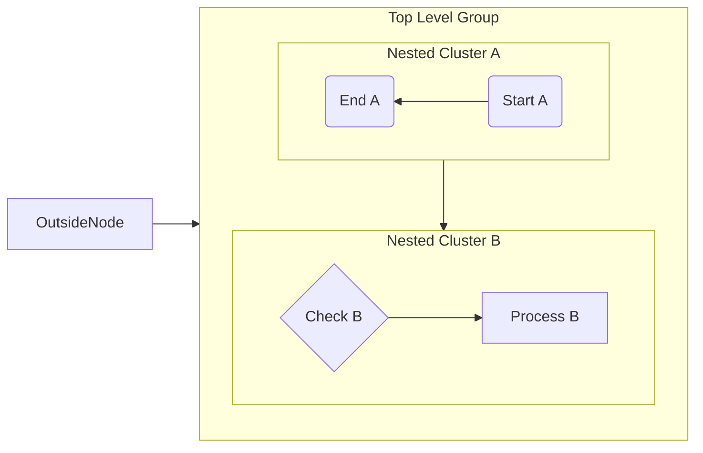
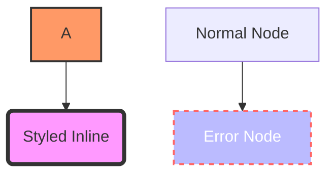
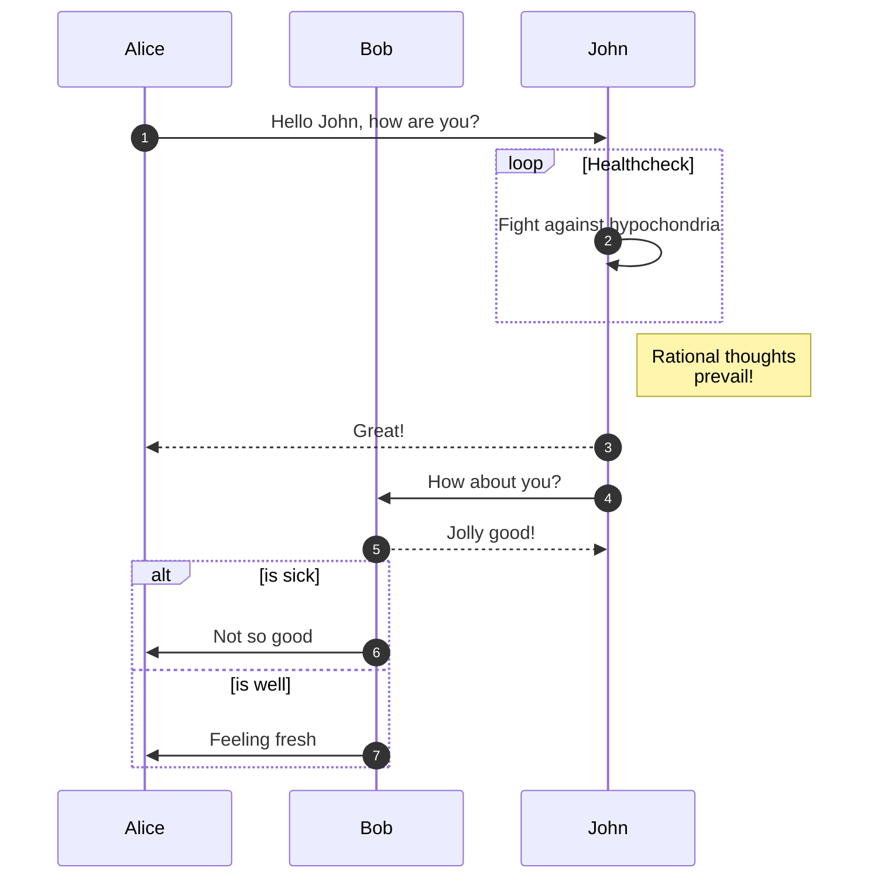
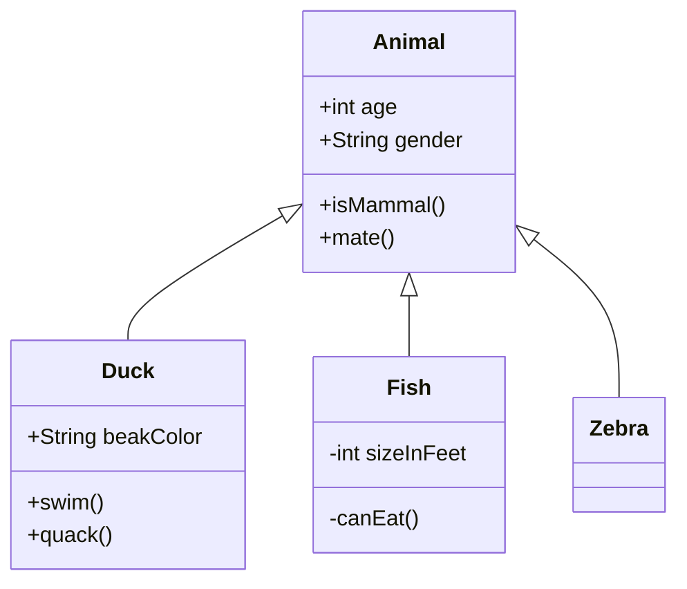
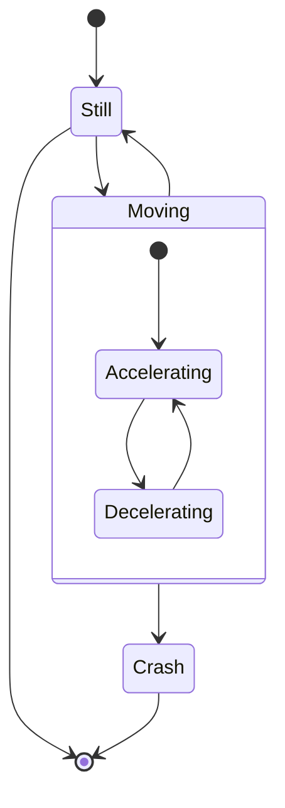
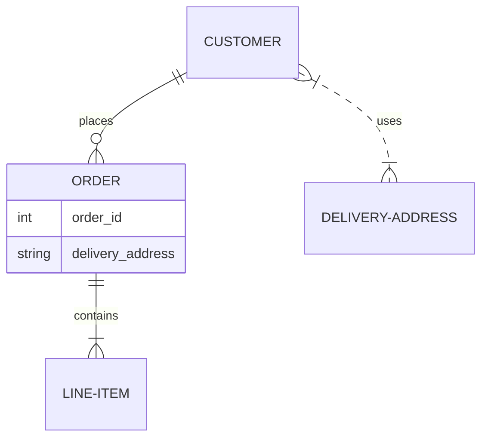
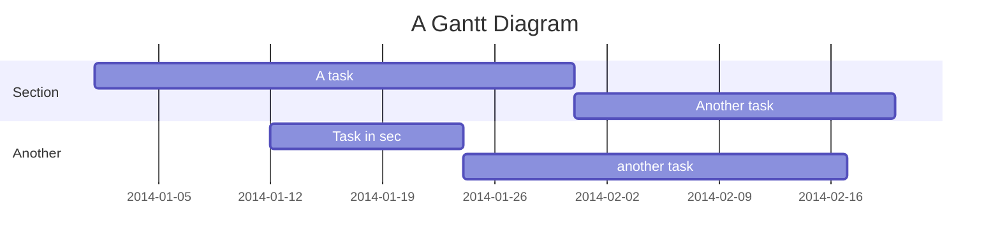
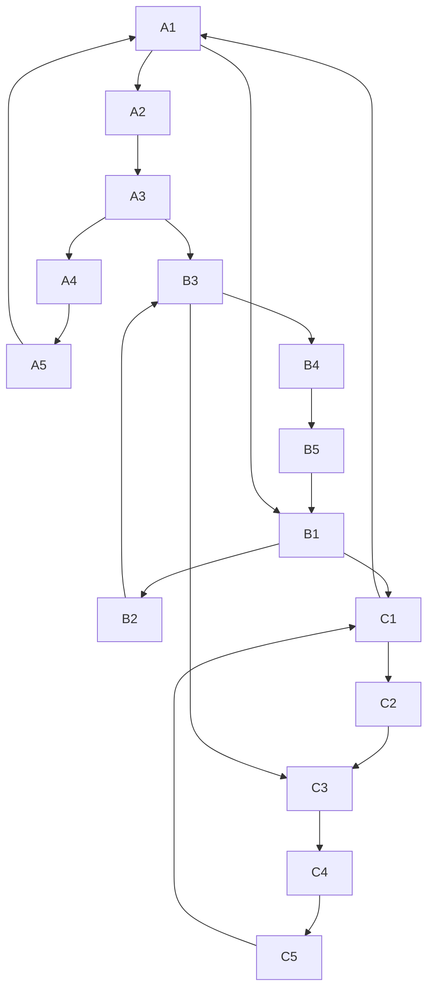
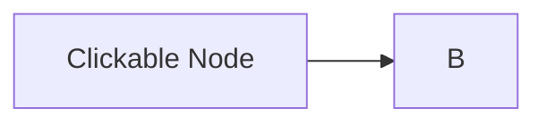

### 1\. The "Kitchen Sink" Flowchart

This graph tests node shapes, edge types, label formatting, and directionality. It is excellent for testing parsing logic and rendering capabilities.

```mermaid
graph TD
    %% Basic Shapes and Edges
    A[Rectangular Node] -->|Text on Edge| B(Round Edge)
    B --> C{Decision Diamond}
    C -->|One| D[Result One]
    C -->|Two| E[Result Two]

    %% Complex Edges
    E -.->|Dotted| F((Circle))
    F ==>|Thick| G([Stadium])
    G --o|Circle Edge| H[[Subroutine]]
    H x-x|Cross Edge| I[(Database)]

    %% Trapped Shapes & Odd Characters
    J>Asymmetric] --> K{{Hexagon}}
    K --> L[/Parallelogram/]
    L --> M[\Trapezoid alt\]
```

-----

### 2\. Nested Subgraphs & Direction

Use this to test recursive parsing, scope handling, and how your library handles clusters.



-----

### 3\. Styling and Classes (CSS/Theme Testing)

If your library modifies, extracts, or renders styles, this string tests `classDef`, inline styles, and class attachment.



-----

### 4\. Special Characters, Escaping, and Unicode

This is crucial for testing encoding errors, JSON serialization issues, or parser crashes due to symbols.

```mermaid
graph TD
    A["Node with spaces"] --> B["Node with \"quotes\" inside"]
    B --> C["Unicode: 🚀 ❤️ α, β, γ"]
    C --> D["Special chars: ! @ # $ % ^ & * ( ) _ + - = [ ] { } | ; : , . < > ?"]
    D --> E["<b>HTML Bold</b> and <i>Italic</i>"]
    E --> F["Markdown **Bold** and *Italic*"]
```

-----

### 5\. Sequence Diagram

Sequence diagrams use a completely different syntax grammar (using `->>` vs `-->`). This tests if your library supports non-flowchart parsing.



-----

### 6\. Class Diagram (Object Oriented)

Tests cardinality, visibility identifiers (`+`, `-`, `#`), and type relationships.



-----

### 7\. State Diagram (v2)

Tests composite states and transition logic.



-----

### 8\. Entity Relationship Diagram (ER)

Tests distinct connector syntax (one-to-one, one-to-many).



-----

### 9\. Gantt Chart

Tests date parsing, axis formatting, and exclusion logic.



-----

### 10\. Large Data / Stress Test

A programmed structure to test memory handling or rendering timeouts.



### 11\. Broken / Invalid Syntax

(Optional but recommended) Feed this to your library to ensure it fails gracefully (raises a specific error rather than crashing).

```mermaid
graph TD
    A --> B
    C -..- // Missing node or bad syntax
    subgraph MISSING_END
    D --> E
```

### 12\. Interaction (Click Events)

If your library handles interactivity or web embedding, test the `click` binding.



-----
